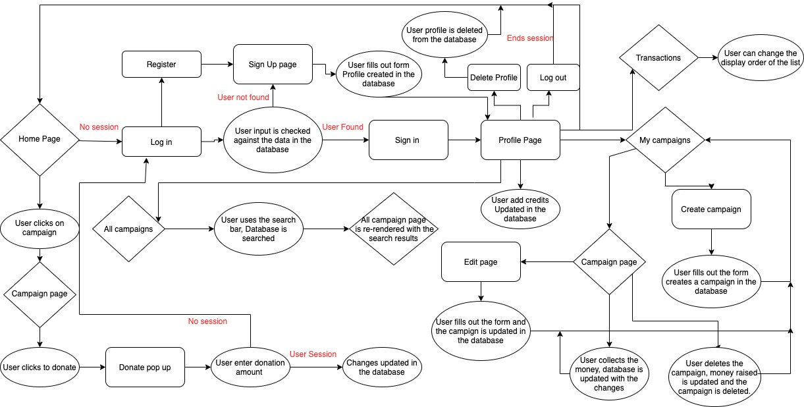

# README for Campaign.com

## Info

Campaign.com is a GoFundMe style fundraising website. We are giving users the ability to sign up and donate to other users' campaigns.

The Web app will need to have the following features to function completely:

- The ability to create a profile.
- The ability to add in-app funds to user profiles.
- The ability to create a campaign.
- The ability to donate to another user's campaign.


[live site](http://ms3-campaign-db.herokuapp.com/home)

## Index

- <a
 href="#ux">UX</a>
- <a
 href="#design">Design</a>
- <a
 href="#testing">Testing</a>
- <a
 href="#deployment">Deployment</a>
- <a
 href="#future">Future Features</a>
- <a
 href="#credits">
 Credits
 </a>

## The App Brief

Here is a copy of the brief [here](https://github.com/josephWoodland/MS3-beer-DB/blob/master/static/assets/readme/design_brief_campaign.pdf)

## Summary of the brief

The client requested an MVP to test the concept of the app. A product that can be released into a small test group to gauge the interest of the idea.

The app will be accessible from marketing campaigns through social media. Meaning that the app must be functional from mobile; even if the design on mobile is limited, the basic functionality must be there.

The app’s look must be clean and, more importantly, functional and clear to the user how to use the app. The client has expressed that the app’s design can be looked at further down the product road map and focus on the functionality.

<span
id="ux">
</span>

## UX

### Target Audience

I have separated the user base into two groups, Donors and Campaigners.

### Donor's

Professional users with a high level of disposable income, looking to donate to a good cause.

### Campaigners

This group are goal-oriented people trying to do something to make a change, passionate about the issue that matters to them.

## Website Goals

### Client

To make a web application that:

- is easy to use and understand.
- will motivate/draw users back to the site each week.
- needs to feel responsive

### Users

As a user, I want:

- to be able to create my profile
- to be able to donate to a good cause
- to be able to create a campaign for something that means a lot to me and have other people donate so I can achieve my goals

### Functions for the app

The app must:

- have the ability to have different user profiles.
- have the ability to add credits to the user profile.
- when a user donates, the amount donated is deducted from the user balance and added to the campaign balance.
- when a campaign has hit its target, there is some sort of user feedback to suggest this.
- have a way to track the user transaction activity.
- have the ability to search through campaigns quickly.

## User Journey

Here are examples of successful user journeys.

Here is the successful journey of a donor.

- I have been redirected to the app via a marketing campaign.
- I have noticed a campaign that I like, and I would like to donate.
- I have been redirected to the registration page.
- I have successfully created an account and deposited some funds into my account.
- I have managed to search or quickly find the campaign again so that I can donate.
- I have successfully managed to donate to a campaign, I can see that the amount of the campaign pot has increased.
- I can check my account to see that the correct amount has reduced my credits.
- I can also verify this by looking at the transaction page to see a transaction report.

Here is the successful journey of a campaigner.

- I am currently trying to raise money for my local school and came across this website.
- I can see that you can raise money for a cause.
- I can see that some campaigns have already been successful in raising their targeted amount of money.
- I have been directed to the user sign up page.
- I have managed to create a profile for myself.
- I have managed to create an engaging campaign for the School.
- I can see that money has come into the campaign from donations.
- I can see which users have sent me the money via the transaction page.
- I can withdraw money from the campaign pot, and it will credit my account.

## User Stories

The user story revolves around essential actions for each user and software interaction to complete a successful user journey.

- As a Donor, I want to see more information about a particular campaign, so I can choose to donate.

- As a Donor, I want to add credits to my account to donate to a campaign.

- As a Donor, I want to search for campaigns to see the progress of previous campaigns where I have donated.

- As a Campaigner, I want to create a campaign to raise money for a cause I support.

- As a Campaigner, I want to see how much money a campaign has made to see if people support my cause.

As a Campaigner, I want to withdraw money from the campaign account to fund the project.

- As a Campaigner, I want to see who has donated to me to send them a thank you email and keep them updated with the campaign’s progress.

## Sections of the Web App

### General Layout

The client is looking for an MVP product with an equally focused design for mobile and desktop.

### Side Navigation Bar

The navigation bar should be simple and easy to understand.  The user should be able to identify if they are logged in or not.

Having a side navigation bar with all the different pages a user can navigate will breed familiarity with the site and reduce the risk of users getting lost in the app.

### Home page

The home page should list some active campaigns and have a section where users can see successful campaigns. These will be there to reassure potential users that previous campaigns have reached their intended targets.

### Profile page

The profile page must have all the basic user information, including the number of credits that the user has and adding more if needed.

### Campaign View page

The campaign view page should be simple with the campaign details and an easily identifiable way to donate.

### Campaign create

The campaign creates page should be a simple HTML form, with easily identifiable tags to fill out.

## Wireframes

Here is a sample of the original wireframes for the app approved by the client.


All the wireframes and design boards can be downloaded [here](https://github.com/josephWoodland/MS3-beer-DB/tree/master/static/assets/readme/Wireframes)

<span
id="design">
</span>

## Design

The design elements were influenced and informed by the client’s brief. Everything should be simple and not unique but familiar.

### Font

### Copy

- Arial and as a backup sans-serif

### Main colours

Brand colours are 

## Features for the website

### Responsive design

- Websites must be functional on both large and small screens.

### Interactive page

- Page HTML must be interactive for the user and must feel fluid.

## Technologies Used

### Languages

HTML5 - I used HTML 5 for the layout and structure of the website.

CSS - CSS has been used to style some HTML elements.

jQuery - jQuery language has been used to create front end interactivity of some HTML elements

Python - Python, has been used so the app can interact with the database.

MongoDB - I chose to use MongoDB as the database to store all of the necessary data that the app uses.

Jinja - The jinja language was used to manipulate the HTML depending on what data returned from various Python functions.

## Frameworks

## App - Flask

I used the flask framework to build the app. This framework has sped up the coding process and given a solid foundation to the app.

## Styling - Materialize

I have used Google Materialize to standardise the styling of this app. For example, selecting the elements I want and then copying and pasting the code into the HTML and any jQuery code needed to make the element interactive.

## Python Libraries

I used modules to help me code the app faster using pre-written code to speed up the process.

- os - This module allows the app to have access to the operating system, giving the app the ability to access environment variables
- flask - This module is the framework for the app, allowing the app to have a user
- flask_pymongo - This module allows the flask framework to connect with the MongoDB database.
- werkzeug.security - This module has been used to create user passwords and for verification.
- datetime - This module has been used to record timestamps by the app.

## Outside libraries

- Font Awesome - I used font awesome for some of my icons.

## Flask modules

- Flask - This is the main library of code for the framework
- flash - This allows the app to display flash messages on the screen when the user completes a specific action.
- render_template - This directs the app to render a specific HTML template
- redirect - This directs the app to an HTML page inside the app on a user action
- request - This allows the app to interact with POST or GET requests from the HTML
- session - This allows the app to create user sessions, allowing the user to log in to the app.
- url_for - This allows the HTML to have links that can interact with the flask code.
- g - I used this to set a global variable for users.

## Software Used

- Git: I used Git to manage the development of the app, committing regularly.

- Git Desktop: I used this to manage commits and push them to the GitHub repository.

- Source tree: I used this to manage my git branch and edit some of my commit messages.

- GitHub: I used GitHub to store the version of the project remotely.

- Adobe XD: I used XD to create and build the wireframes.

## VS Code

I used VS Code as my code editor. In the code editor, the extensions that I used were:

- Prettier: automatically format my code for basic formatting mistakes and have a consistent style throughout the code.
- Image preview: I used this extension to identify whether or not the image URL path is correct.
- Markdown all in one: I used this extension to help me edit the readme file in VS Code.

## Website Structure

The diagram here is a layout of the website’s information structure and how it will flow for the user.

<details
>

<summary
>Click here to view the image</summary>



</details>

## Coding Architecture

I have used a simple architecture for this app with all the code from each language in one file and separated the code into sections by comment lines.

## Database

I am using MongoDB to store the data for the app, trying to take advantage of the document style of saving data. Instead of using lookup tables to connect relevant data, all relevant data related to that particular document can be embedded into a single document.

### Schema

I am using a one-to-few approach to the relationship of my data, using referencing to connect given data together. I have decided to split the database up into three main collections, with the rationale of limiting the size of each document and each document having its own `\_id`.

This is because there is a hard limit in the size of documents that can be saved to MongoDB of 16MB. Each user can have an unlimited number of transactions and an unlimited number of campaigns, so I will have to hold each of these documents in a separate collection, with all the necessary tags to connect the user activity.

### Database collections

User - This will keep all of the user data.

<details
>

<summary
>Click here to view the database</summary>


</details>

Campaigns - This will store all the data from each campaign.

<details
>

<summary
>Click here to view the database</summary>
 

 
</details>
Transactions - This will store data from each transaction in the app.
<details
>

<summary
> Click here to view the database</summary>


</details>

## User Input Validation

I used a mixture of HTML and Python code to validate user input. This is to ensure that the user data is correct before being sent to the database.

### HTML

- Name validation - Using the `type=”text”` attribute on the form with a `minlength=”3”`
- Username validation - Using the `type=”email”` attribute to ensure that the input follows the traditional email format.
- Profile and campaign images - Using the `type=”file”` attribute and specifying that it will only accept a `.jpg` file.
- Password - Using the `type=”password”` attribute on the form with a `minlength=”5”`

### Python

- Username Validation - As the app uses emails as user identifier's. We needed a function to check that the user imputed email against the emails in the database.
- Password - For registering, we do basic checks to see if the two password inputs match for creating the user password.
- Password - When the user is logging in, we grab the user data from the database and check the hashed password with the one stored for that user.
 - Images - I am using `app.config['MAX_CONTENT_LENGTH']` to set the max size of the file, giving a flash message for the user.

## Online resources

These are the online resources that I used throughout the project.

### [Materialize](https://materializecss.com/)

### [Stack Overflow](https://stackoverflow.com/)

### [YouTube](https://www.youtube.com/)

<span
id="testing">
</span>

## Testing

### Automated Code Validation

### HTML Test

I used the [W3C HTML validator](https://validator.w3.org/) to validate each page.

I had a recurring error, which was to do with overfunded campaigns. Using a tooltip to illustrate the progress of a campaign throws an error in the validator when the percentage funded is larger than the max value of the tooltip. As this is vital to show the state of overfunded campaigns, I ignored this error. I have highlighted the error below on the page that is affected:

- Home - Tooltop Error - Pass
- Profile - Pass
- User_campaigns - Pass
- Campaigns - Tooltip error - Pass
- Transactions - Pass
- Signin - Pass
- Register - Pass

### CSS Test

I used the [W3C CSS validator](https://jigsaw.w3.org/css-validator/) to validate the css:

- style.css - Pass

### jQuery Test

I used [JSHint](https://jshint.com/) to validate the JavaScript:

As I was using JQuery I had to use `/*globals $:false */` at the top of the page to declare the $ is a variable to stop the Error of undefined variable.

- script.js - Pass

### Python Tests

I used [PEP8 online](http://pep8online.com/) to validate the Python:

- app.py - Pass

## Manual testing

### Testing Environments

I used two sets of hardware to undergo building and testing the app; I used a 2012 28 inch iMac and a 2020 13inch Macbook air with the M1 processor. On both, I was primarily using the Google Chrome web browser.

### Desktop testing

Platforms :

- MacBook Air 2020 M1 - OS Big Sur
- Mac - OS Catalina

Browsers:

- Chrome
- Firefox
- Safari

Mobile testing:

- Pixel 4 (Android 11)
- iPhone 12 (IOS 14)

Browsers:

- Chrome
- Safari
<span
 id="testing-responsive">
</span>

## Testing - Design Responsiveness

### Simulated Testing

For each page, I used the Google Developer tools to simulate different screen sizes.

Tested with Chrome DevTools using profiles for with screen sizes:

- Moto G4
- Galaxy S5
- Pixel 2
- Pixel 2 XL
- iPhone 5 SE
- iPhone 6/7/8
- iPhone 6/7/8 Plus
- iPhone X
- iPad
- iPad Pro

Also used the responsive profiles preset in the dev tools of:

- Mobile S (320px)
- Mobile M (375px)
- Mobile L (425px)
- Tablet (768px)
- Laptop (1024px)
- Laptop L (1440px)

## Major testing issues identified

G.user - once I used the global variable for the user session, I had a recurring issue where the app would not have a user variable when rendering a template.

## User testing

I gave the app to three people to test and to populate the database with data.

### User Tests

1. **User One** - This user accessed the app on his iPhone 11:
   1. Experienced some design issue’s with the home page.
       - To solve this, I changed the amount of space each tile took up and edited the name by removing the `.com` from the title.
   2. He also shared a bug where he could add minus numbers when adding credits.
        - This was fixed by adding `min="1"` to the input box.
 2. **User Two** - This user accessed the app via a ThinkBook laptop:
   1. Commented that it was a challenge to understand what the app was designed to do.
      - To solve this, I updated the home page when there was no session cookie, with an opening message explaining the use of the app.
3. **User Three** - This user accessed the app a Dell laptop:
   1. Highlighted a bug where deleting a profile would just log the user out and not delete the profile.
      - To fix this, I changed the function to incorporate the process in the function instead of redirecting to `def log_out`:
        -  ```
           session.pop("user")
           mongo.db.users.remove(
                     {"_id": user["_id"]})
           ```
   1. Highlighted a bug where deleting a user would not delete the user campaigns.
        - To fix this, I searched for campaigns connected to the user and then deleted them from the database:
           -  ```
               user_id = str(user["_id"])
               mongo.db.campaigns.remove(
                         {"creator_id": user_id})
               ```

## Testing User Stories Checklists

### Donors stories

- As a Donor, I want to see more information about a live campaign so I can choose which campaign to donate to - completed

- As a Donor, I want to add credits to my account so that I can donate to a campaign - completed

- As a Donor, I want to search for campaigns so I can see the progress of previous campaigns I have donated to - completed

### Campaigners stories

- As a Campaigner, I want to create a campaign so I can raise money for a cause I believe in - completed

- As a Campaigner, I want to see how much money a campaign has made so I can see if I have support for my cause - completed

- As a Campaigner, I want to withdraw money from the campaign account so that I can fund the project - completed

- As a Campaigner, I want to see who has donated to me so I can send them a thank you email and keep them updated with the progress of the campaign - completed

### Side Bar

Here are all the tests for the side navigation bar to see if the links have the desired response.

- Does the sidebar only show all the items when logged in - check
- Does the profile image change - check
- Does the profile link work - check
- Does the My Campaigns link work - check
- Does the All campaigns link work - check
- Do the Transactions link work - check
- Does the Sign-out link work - check
- Does the Delete profile link work - check

### CRUD Database tests

Create

- Create a profile - check
- Create a campaign - check

Read

- Read all the campaigns data for the home page - check
- Read the campaign data for the campaign view - check
- Read if a user has a profile - check
- Read if the user password input matches the one in the database - check
- Read profile data - check
- Read the transaction data - check

Update

- Update the Campaign information by the campaign edit form - check
- Update the number of credits a profile has when adding credits via the profile section
- Update the number of credits a profile has when the user donates - check
- Update the number of credits the campaign has when the campaign has received a donation - check
- Update the number of credits a user has when they withdraw credits from a campaign - check

Delete

- Delete a campaign from the database - check
- Delete a user from the database - check

### Functionality testing

- have the ability to have different user profiles - check
- have the ability to add credits to the user profile - check
- when a user donates, the amount donated is deducted from the user balance and - added to the campaign balance - check
- when a campaign has hit its target, there is some sort of user feedback to suggest this - check
- have a way to track the user transaction activity - check
- have the ability to search through campaigns easily - check

## Issues and challenges I encountered

The main issue with the app was storing images in the database and then rendering them to the HTML. After researching this on the internet, I found an excellent video that explained the process.

## Source Tree

- I experienced a problem when I used SourceTree to edit previous commit messages. When I edit a message and try to push the current branch to GitHub, it will always show that the remote branch is ahead of the local branch. After spending time researching this, I could not understand why this was happening or how to fix it.

## Known bugs

- Image bug - Experanicing file clashes when the files that are uploaded have the same name. To fix this issue, I could try and create an image_id for each image and recall the id instead of the image name.

- AttributeError - One test user experienced an `AttributError: user` Error, which went away with reloading the page; I have not been able to recreate this Error. The user was travelling on a train and accessing the app via a phone. I think it might have something to do with a drop in signal. The time the app sends the user data to the server to populate the HTML, so it has no user Attribute, It throws the error. However, it clears once the user reloads the page. Again, I am not sure how to recreate this or fix this problem. I added AttributError to be caught in the before request function, but I am unsure if this would have the desired effect.

<span
id="deployment">
</span>

## Deployment

I just used one GitHub branch so clone the master branch.

### How to deploy

### Run this code locally

Clone this project from GitHub by the terminal:

- Under the repository name, click Clone or download
- In the Clone with HTTP section, copy the clone URL for the repository
- In your local IDE, open Git Bash
- Change the current working directory to the location where you want the cloned directory to be made.
- Type git clone and then paste the URL you copied in Step 2
 <https://github.com/josephWoodland/MS3-beer-DB>
- Press Enter. Your local clone will then be created.

Clone this project from GitHub by the Git Desktop:

- Under the repository name, click Clone or Download
- Click the option to use GitHub Desktop
- In the clone, Repository Modal choose where you would like it to be stored locally
- The clone has been created and stored in your local file.

Further reading and troubleshooting on cloning a repository from GitHub can be found [here](https://docs.github.com/en/github/creating-cloning-and-archiving-repositories/cloning-a-repository)

### Running the code

To deploy the app locally, once you have cloned the repository, you will need to create an env.py file in the directory to create the development environment.
`
import os

   os.environ.setdefault("IP", "0.0.0.0")
   os.environ.setdefault("PORT", "5000")
   os.environ.setdefault("SECRET_KEY", "<Your secret key>")
   os.environ.setdefault(
       "MONGO_URI", "mongodb+srv://<user>:<password>@<project>.af8bz.mongodb.net/<database>?retryWrites=true&w=majority")
   os.environ.setdefault("MONGO_DBNAME", "<database>")

`

### Deploying to Heroku

You will need to sign up for Heroku
Once logged in, click the create new app button
Select the region closest to you and give the APP a name
Set your deployment method to 'GitHub.'
Connect to GitHub and login
Search for the repository you wish to deploy from
You will have to add your `Config Vars` this will be everything you have in your env.py so that Heroku will have all the keys needed to use the app.
You will need to have a `Procfile`, and you will have to update a requirements.txt, so the app has all the necessary extensions to run.
From there, you should be able to deploy the app.

<span
id="future">
</span>

## Future Features - App Roadmap

### Message feature

A messaging feature in the app would be the next update that I would commission. Giving the users the ability to message anyone through the app that has dominated and includes automatic updates on campaigns they have donated to.

### Overfunded campaigns

- I would like to have more of an event around user campaigns being overfunded, whether or not they would receive an automatic message.

### Home page redesign

I would like to redesign the home screen with more sections to make it easier to find a campaign you want to donate to and highlight some specific campaigns.

<span
id="credits">
</span>

## CREDITS

My mentor Jack helped guide me throughout the project.

I used this YouTube video from the pretty printed youtube channel to help me understand how to upload and recall files using MongoDB and Flask.

[Pretty Printed](<https://www.youtube.com/watch?v=DsgAuceHha4>)

I also used Code Institute support for a bug around deleting users.

I used StackOverflow as a reference point throughout the project whenever I got stuck.
