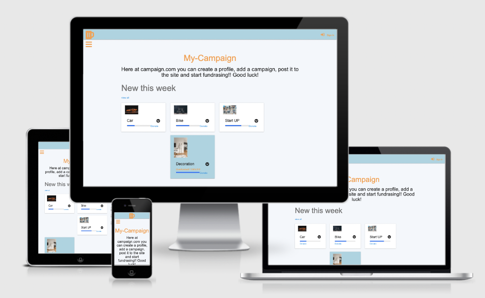
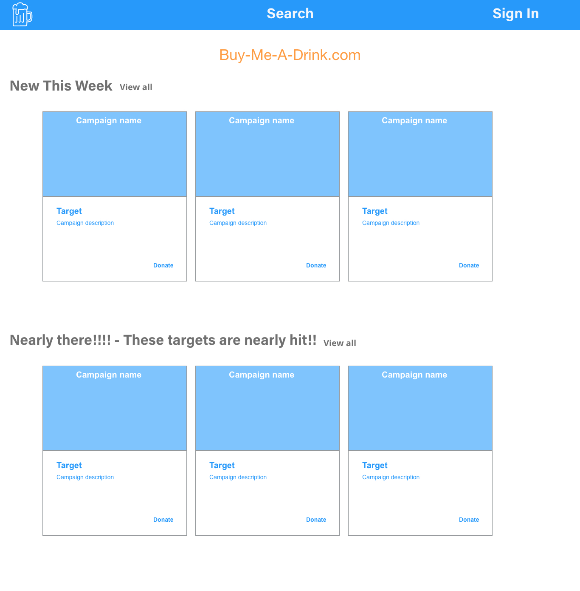
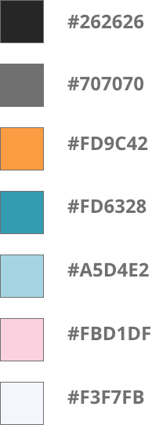
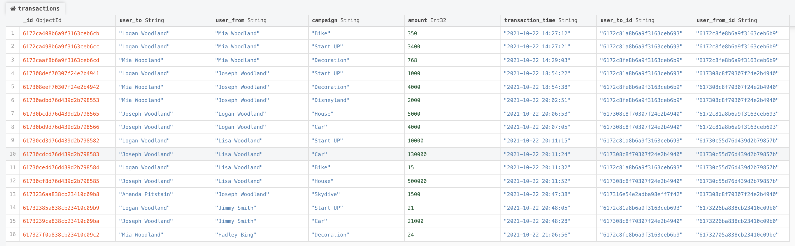

# README for Campaign.com

## Intro

Campaign.com is a GoFundMe style fundraising website. Giving users the ability to sign up and donate to other users' campaigns.

The Web app will need to have the following features to function completely:

- The ability to create a profile.
- The ability to add in-app funds to user profiles.
- The ability to create a campaign.
- The ability to donate to another user's campaign.

[[live site](http://ms3-beer-db.herokuapp.com/home)]

## Index

- <a
  href="#The-Website-Brief">The Website Brief</a>
- <a
  href="#ux">UX</a>
- <a
  href="#design">Design</a>
- <a
  href="#testing">Testing</a>
- <a
  href="#deployment">Deployment</a>
- <a
  href="#future">Future Features</a>
- <a
  href="#credits">
  Credits
  </a>

## The App Brief

This is a copy of the brief [here](https://github.com/josephWoodland/MS3-beer-DB/blob/master/static/assets/readme/design_brief_campaign.pdf)

## Summary of the brief

The client requested a MVP to test the concept of the app. A product that can be put out into a small test group to gauge the interest of the idea.

The app will be accessible from marketing campaigns through social media, this means that the app must be functional from mobile, even if the design on mobile is limited, the basic functionality must be there.

The look of the app must be clean and more importantly functional, and clear to the user how to use the app. They have expressed that the design of the app can be looked at further down the product road map, and to focus on the functionality.

## UX

### Target Audience

The target audience for this project can be divided into two groups.

### Donor's

Professional users with a high level of disposable income, looking to donate to a good cause.

### Campaigners

This group are goal oriented people who are trying to do something to make a change, passionate about the issue that matter two them.

## Website Goals

### Client

To make a web application that:

- is easy to use and understand.
- will motivate/draw users back to the site each week.
- needs to feel responsive

### Users

As a user I want:

- to be able to create my profile
- to be able to donate to a good cause
- to be able to create a campaign for something that means a lot to me and have other people donate so I can achieve my goals

### Functions for the app

The app must:

- have the ability to have different user profiles.
- have the ability to add credits to the user profile
- when a user donates the amount donated is deducted from the user balance and added to the campaign balance
- when a campaign has hit its target there is some sort of user feedback to suggest this
- have a way to track the user transaction activity.
- have the ability to easily search through campaigns.

## User Journey

This is an example of a successful user journey.

This is the journey of a donor.

- I have been redirected to the app via a marketing campaign.
- I have noticed a campaign that I would like to donate to.
- I have been redirected to the signup page.
- I have successfully created an account and given the ability to deposit some funds to my account.
- I have managed to search or easily find the campaign I wanted to donate to.
- I have usefully managed to donate to the campaign - noticing the change in the amount the campaign has been funded.
- I can check my account to see that my credits have been reduced by the right amount
- I can also verify this by looking at the transaction page to see a report of the transaction.

This is the journey of a campaigner.

- I am trying to raise money for my local school and came across this website.
- I can see that you can raise money for a cause
- I can see that some campaigns have already been successful in raising their targeted amount of money.
- I have been directed to the user sign up page
- I have managed to create a profile for myself.
- I have managed to create engaging camping for the School
- I have seen that money has come into the campaign.
- I can see which users have sent me the money via the transaction page.
- I can withdraw money from the camping pot and it will credit my account.

## User Stories

For each of the interactions between user and software to complete a successful user journey, these are the individual user story around essential actions.

- As a Donor, I want to see more information about a live campaign so I can choose which campaign to donate to.

- As a Donor, I want to add credits to my account so I can donate to a campaign.

- As a Donor, I want to search for campaigns so I can see the progress of previous campaigns I have donated to.

- As a Campaigner, I want to create a campaign so I can raise money for a cause I believe in.

- As a Campaigner, I want to see how much money a campaign has made so I can see if I have support for my cause.

- As a Campaigner, I want to withdraw money from the campaign account so I can fund the project.

- As a Campaigner, I want to see who has donated to me so I can send them a thank you email, and keep them updated with the progress of the campaign.

## Sections of the Web App

### General Layout

Given the brief from the client, we are looking for a mobile responsive design where the basic features of the app can be achieved on mobile and also on the desktop.

### Side Navigation Bar

The navigation bar should be simple and easy to understand and should be easily identifiable to the user whether they are logged in or not.

Having a side navigation bar with all the different pages a user can navigate to, will breed familiarity with the site and reduce the risk of users getting lost in the app.

### Home page

The home page should have a list of some of the active campaigns, and also a section where users can see overfunded campaigns. Just to reassure some potential users that previous campaigns have reached their intended targets.

### Profile page

The profile page must have all the basic user information in there, including the number of credits that the user has and the ability to add more if needed.

### Campaign View page

This should be a simple page with the campaign details on it and an easily identifiable way to donate.

### Campaign create

This should be a simple HTML form, easily identifiable tags for the user to fill out to create a campaign.

## Wireframes

Here is a sample of the original wireframes for the app approved by the client.

All the wire-frames and design boards can be downloaded [here](https://github.com/josephWoodland/MS3-beer-DB/tree/master/static/assets/readme/Wireframes)

## Design

The design elements were influenced and informed by the client’s brief, that everything should be simple and not unique, but familiar.

### Font

### Copy

- Arial and as a back up sans-serif

### Main colours

Brand colours are 

## Features for the website

### Responsive design

- Websites must be functional on both large and small screens.

### Interactive page

- Page HTML must be interactive for the user and must feel fluid.

## Technologies Used

### Languages

HTML5 - I used HTML 5 for the layout and structure of the website.

CSS - CSS has been used to style some HTML elements.

jQuery - jQuery has been used to add to the front end interactivity of some HTML elements

Python - The Python language has been used the most in the making of this app. It has been used so the app can interact with the database.

MongoDB - I chose to use MongoDB as the database to store all of the necessary data that the app uses.

Flask - I used the flask framework to build the app around. This framework has sped up the coding process and given a solid foundation to the app when years are navigating through the different functionalities.

Jinja - I used jinja HTML template language to make it easy for the HTML to be manipulated depending on what information is being sent to the app via the Python functions.

## Styling - Materialize

I have used Google materialize to standardize the styling of this app. Selecting the elements that I want and then copying and pasting the code into the HTML and also any jQuery code that is needed to make the element interactive.

## Website Structure

The diagram here is a layout of the information structure of the website and how it will flow for the user.

Click here to view the image

## Coding Architecture

I have used a simple architecture for this app with having all the code from each language in one file only. With all the Python code on an `app.py` file. I have separated the route functions from the other functions to help with the navigation, but have kept all the code in one place.

## Database

I am using MongoDB to store the data for the app, trying to take advantage of the document style of saving data, meaning that instead of using lookup tables to connect relevant data, all relevant data related to that particular document can be embedded into a single document.

### Schema

Using a one-to-few approach to the relationship of my data, using referencing to connect given data together. I have decided to split the database up into three main collections, with the rationale of limiting the size of each document, each document having its own `\_id`.

The reason behind this is there is a hard limit in the size of documents that can be saved to MongoDB of 16MB. As each user can have an unlimited number of transactions and an unlimited number of campaigns, saving each of these in a separate collection, with all the necessary tags to connect the user activity.

### Database collections

User - This will keep all of the user data.

Click here to view the database

Campaigns - This will store all the data from each campaign.

Click here to view the database

Transactions - This will store data around each transaction that is completed through the app.

 Click here to view the database

## VS Code

I used VS Code as my code editor. In the code editor, the extensions that I used were:

- Prettier: to automatically format my code for basic formatting mistakes and to have a consistent style throughout the code.
- Image preview: I used this extension that shows a preview of any linked images in my code to help me quickly identify if the URL path is correct and to identify the right image.
- Markdown all in one: I used this which enabled me to edit the readme file with live preview in VS Code.

## Python Libraries

I used modules to help me code the app faster using pre-written code to speed up the process.

- os - This module allows the app to have access to the operating system, giving the app the ability to access environment variables
- flask - This module is the framework for the app, allowing the app to have a user
- flask_pymongo - This module allows the flask framework to connect with the MongoDB database.
- werkzeug.security - This module has been used to create user passwords and verification.
- datetime - This module has been used to record timestamps by the app.

## Outside libraries

- Font Awesome - I used font awesome for some of my icons.

## Flask modules

- Flask - This is the main library of code for the framework
- flash - This allows the app to display flash messages on the screen when a specific action has been completed by the user.
- render_template - This directs the app to render a specific HTML template
- redirect - This directs the app to an HTML page inside the app on a user action
- request - This allows the app to interact with POST or GET requests from the HTML
- session - This allows the app to create users sessions allowing the ability to have the user logged in to the app.
- url_for - This allows the HTML to have links that can interact with the flask code.
- g - I used this to set a global variable for users.

## Software Used

- Git: This was used to manage the different versions of my project, using different branches to test and add new features/sections to the website. Once tested they were then merged into the master branch and then, using Git Desktop pushed to the GitHub repository.

- Git Desktop: I used this to manage commits and push them to the GitHub repository.

- Source tree: I used this to manage my git branches, and to edit commit messages.

- GitHub: I used GitHub to store the version of the project remotely.

- Adobe XD: I used XD to create and build the wireframes, to design some of the unique icons on the page and the unique colour patterns on the page.

## User input validation

I used different validation methods to make sure that the imputed data is valid. Using a mixture of HTML and Python data validation techniques. Using Python to check input against data in the database, i.e password check, and using the HTML to check the user input at the point of input.

### HTML

- Name validation - Using the `type=”text”` attribute on the form with a `minlength=”3”`
- Username validation - Using the `type=”email”` attribute to make sure that the input follows the traditional email format.
- Profile and campaign images - Using the `type=”file”` attribute and specifying that it will only accept a `.jpg` file.
- Password - Using the `type=”password”` attribute on the form with a `minlength=”5”`

### Python

- Username Validation - As we are using user emails as usernames, in the register function we check to see if the email is already in the database giving a different response on whether the user is registering or trying to login.
- Password - For registering we do basic checks to see if the two password inputs match for creating the user password.
- Password - When the user is logging in, we grab the user data from the database and check the hashed password with the one that is stored for that user.
  -Images - I am using `app.config['MAX_CONTENT_LENGTH']` to set the max size of the file, giving a flash message for the user.

## Online resources

These are the online resources that I used throughout the project

### [Materialize](https://materializecss.com/)

### [Stack Overflow](https://stackoverflow.com/)

### [YouTube](https://www.youtube.com/)

## Testing

### Automated Code Validation

### HTML Test

I used the [W3C HTML validator](https://validator.w3.org/) to validate each page. I had one recurring issue around the function of the website to show if a campaign is overfunded, this is around the value of the tooltip should not be greater than the maximum, this is shown as the tooltip Error below:

- Home - Tooltop Error - Pass
- Profile - Pass
- User_campaigns - Pass
- Campaigns - Tooltip error - Pass
- Transactions - Pass
- Signin - Pass
- Register - Pass

### CSS Test

I used the [W3C CSS validator](https://jigsaw.w3.org/css-validator/) to validate the css:

- style.css - Pass

### jQuery Test

I used [JSHint](https://jshint.com/) to validate the JavaScript:

As I was using JQuery I had to use `/*globals $:false */` at the top of the page to declare the $ is a variable to stop the Error of undefined variable.

- script.js - Pass

### Python Tests

I used [PEP8 online](http://pep8online.com/) to validate the Python:

- app.py - Pass

## Manual testing

### Testing Environments

I used branches in Git to create a safer environment to develop different features and sections of the app. Once the initial section/feature had been finished and the initial test had been completed, the branch would merge with the master branch.

I used two sets of hardware to undergo building and completing the tests for the app; I was using a 2012 28 inch iMac and a 2020 13inch Macbook air with the M1 processor. On both, I was primarily using the Google Chrome web browser.

### Desktop testing

Platforms :

- MacBook Air 2020 M1 - OS Big Sur
- Mac - OS Catalina

Browsers:

- Chrome
- Firefox
- Safari

Mobile testing:

- Pixel 4 (Android 11)
- iPhone 12 (IOS 14)

Browsers:

- Chrome
- Safari
  
  

## Testing - Design Responsiveness

### Simulated Testing

For each section on each page, I tested various screen sizes in the development environment. Using the Google Developer tools I tested the responsiveness throughout the development process. I updated the code as I tested, noting anything that appeared irregular or out of sync with the layout of the page.

Tested with Chrome DevTools using profiles for with screen sizes:

- Moto G4
- Galaxy S5
- Pixel 2
- Pixel 2 XL
- iPhone 5 SE
- iPhone 6/7/8
- iPhone 6/7/8 Plus
- iPhone X
- iPad
- iPad Pro

Also used the responsive profiles preset in the dev tools of:

- Mobile S (320px)
- Mobile M (375px)
- Mobile L (425px)
- Tablet (768px)
- Laptop (1024px)
- Laptop L (1440px)

## Major testing issues identified

G.user - once I used the global variable for the user session, I had a recurring issue where the app would not have a user variable when rendering a template.

## User testing

I gave the app too three people to test, and to populate the database with data.

### User Tests

User One - This user used the app on his mobile phone, and experienced some design issue’s with the home page, to solve these I changed the amount of space that each tile takes up. He also experience a bug where he could add minus numbers when adding credits.

User Two - This user used a laptop to access the app, and did not encounter any problems, did comment on not fully understanding what the app was about the first time.

User Three - This user used a laptop, experienced an issue when deleting some tester profiles, where the profile was not being deleted properly.

## Testing User Stories Checklists

### Donors stories

- As a Donor, I want to see more information about a live campaign so I can choose which campaign to donate to - completed

- As a Donor, I want to add credits to my account so I can donate to a campaign - completed

- As a Donor, I want to search for campaigns so I can see the progress of previous campaigns I have donated to - completed

### Campaigners stories

- As a Campaigner, I want to create a campaign so I can raise money for a cause I believe in - completed

- As a Campaigner, I want to see how much money a campaign has made so I can see if I have support for my cause - completed

- As a Campaigner, I want to withdraw money from the campaign account so I can fund the project - completed

- As a Campaigner, I want to see who has donated to me so I can send them a thank you email, and keep them updated with the progress of the campaign - completed

### Side Bar

This is to go through the testing of all the links in the side navigation bar to see if they have the desired response.

- Does the sidebar only show all the items when logged in - check
- Does the profile image change - check
- Does the profile link work - check
- Does the My Campaigns link work - check
- Does the All campaigns link work - check
- Do the Transactions link work - check
- Does the Sign-out link work - check
- Does the Delete profile link work - check

### CRUD Database tests

Create

- Create a profile - check
- Create a campaign - check

Read

- Read all the campaigns data for the home page - check
- Read the campaign data for the campaign view - check
- Read if a user has a profile - check
- Read if the user password input matches the one in the database - check
- Read profile data - check
- Read the transaction data - check

Update

- Update the Campaign information by the campaign edit form - check
- Update the number of credits a profile has when adding credits via the profile section
- Update the number of credits a profile has when the user donates - check
- Update the number of credits campaign has when the campaign has received a donation - check
- Update the number of credits a user has when they withdraw credits from a campaign - check

Delete

- Delete a campaign from the database - check
- Delete a user from the database - check

### Functionality testing

- have the ability to have different user profiles - check
- have the ability to add credits to the user profile - check
- when a user donates the amount donated is deducted from the user balance and - added to the campaign balance - check
- when a campaign has hit its target there is some sort of user feedback to suggest this - check
- have a way to track the user transaction activity - check
- have the ability to easily search through campaigns - check

## Issues and challenges I encountered

The main issue I had with the app was with storing images in the database and then rendering them to the HTML. After researching this on the internet I found a very good video that explained the process.

## Known bugs

- Image bug - If users upload an image with the same name as one and another the same image would be used as the program searches for image name - I think I could get around this by adding user_id to the name of the image.

- AttributeError - One test user experienced an `AttributError: user` Error, which went a away with reloading the page, I have not been able to recreate this Error, the user was traveling on a train and accessing the app via a phone. I think it might have something to do with a drop in signal and the time the app is sending the user data to the server to populate the HTML, so it has no user Attribute, throws the error but clears once the user reloads the page. I am not sure how to recreate this or fix this problem. I added AttributError to be caught in the before request function, but I am not sure if this would have the desired effect.

## Deployment

I just used one GitHub branch so clone the master branch.

### How to deploy

### Run this code locally

Clone this project from GitHub by the terminal:

- Under the repository name, click Clone or download
- In the Clone with HTTP section, copy the clone URL for the repository
- In your local IDE open Git Bash
- Change the current working directory to the location where you want the cloned directory to be made
- Type git clone and then paste the URL you copied in Step 2
  <https://github.com/josephWoodland/MS3-beer-DB>
- Press Enter. Your local clone will be created

Clone this project from GitHub by the Git Desktop:

- Under the repository name, click Clone or Download
- Click the option to use GitHub Desktop
- In the clone, Repository Modal choose where you would like it to be stored locally
- The clone has been created and stored in your local file.

Further reading and troubleshooting on cloning a repository from GitHub can be found [here](https://docs.github.com/en/github/creating-cloning-and-archiving-repositories/cloning-a-repository)

### Running the code

To deploy the app locally once you have cloned the repository you will need to create an env.py file in the directory to create the development environment.
`
import os

    os.environ.setdefault("IP", "0.0.0.0")
    os.environ.setdefault("PORT", "5000")
    os.environ.setdefault("SECRET_KEY", "<Your secret key>")
    os.environ.setdefault(
        "MONGO_URI", "mongodb+srv://<user>:<password>@<project>.af8bz.mongodb.net/<database>?retryWrites=true&w=majority")
    os.environ.setdefault("MONGO_DBNAME", "<database>")

`

### Deploying to Heroku

You will need to sign up for Heroku
Once logged in click the create new app button
Select the region closest to you and give the APP a name
Set your deployment method to 'GitHub'
Connect to GitHub and login
Search for the repository you wish to deploy from
You will have to add your `Config Vars` this will be everything that you have in your env.py so that Heroku will have all the keys needed to use the app.
You will need to have a `Procfile` and you will have to update a requirements.txt so the app has all the necessary extensions to be able to run.
From there you should be able to deploy the app.

## Future Features

### Message feature

I would like to have a feature where there is a message section for the users, where they could get updates on campaigns that they have donated to.

### Overfunded campaigns

- I would like to have more of an event around user campaigns being overfunded, whether or not they would receive an automatic message.

### Home page redesign

- I would like to redesign the home screen so there are more sections, making it easier to find a campaign that you want to donate to, and also highlight some specific campaigns easier.

## CREDITS

My mentor Jack helped guide me throughout the project.

I used some youtube videos to help me with figuring out how to upload pictures to the DB and how to use them in the app. This is from the pretty printed youtube channel.

[Pretty Printed](<https://www.youtube.com/watch?v=DsgAuceHha4>)

I also used the Code Institute support for a bug around deleting users.

I used StackOverflow as a reference point throughout the project whenever I got stuck.
